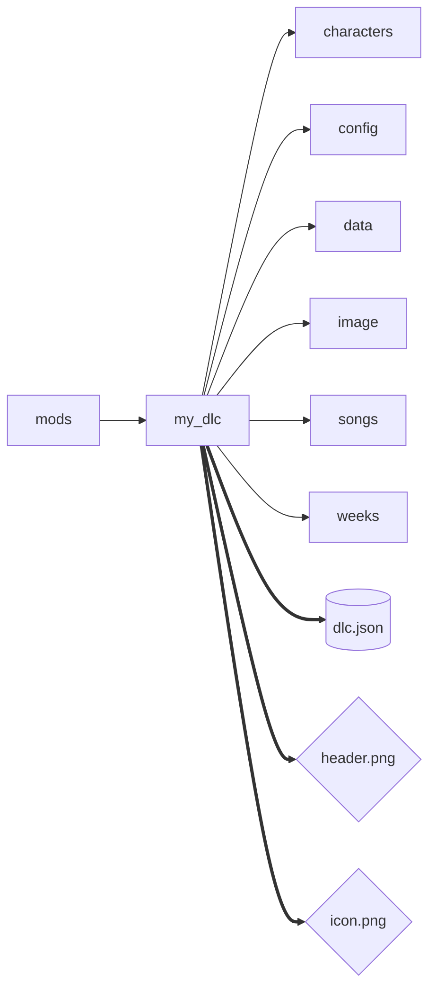
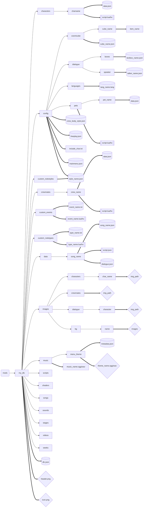

# Create DLC Folder
DLCは、非ビルド形式のmodと同じくmodsフォルダーで管理されます。

## 最初のフォルダ構成
最低限必要なフォルダです。


## dlcのmetadataを作成
`dlc.json`は、DLC Menuに表示されるDLCの顔のようなものです。

例として、Jorsawsee's Spike DLCの`dlc.json`の中身を見てみましょう。

```json
{
    "name": "Jorsawsee's Spike",
    "version": "1.0.0",
    "api_version": "1.0.0",
    "color": "#C300FF",
    "credits": [
        {
            "header": "Developer",
            "people": [
                {"name": "Youbadao", "desc": "Director, Artist, Animater, Musician and Programmer", "link": "https://x.com/Youba_mint"},
                {"name": "Shikumiro", "desc": "Artist and Animater", "link": "https://x.com/shikumiro7"},
                {"name": "Teru Yamane", "desc": "Musician", "link": ""}
            ]
        }
    ]
}
```

* `name`: DLC Menuに表示されるdlc名。
* `version`: DLCのバージョン。
* `api_version`: modのapiバージョン。メジャーアップデートにより変更される可能性がある。
* `color`: DLC Menuの背景のカラー。
* `credits`: DLC制作に直接的・間接的に関わった人々を記入するための場所。
  * `header`: グループ分け用のヘッダー。
  * `people`: DLC制作に直接的・間接的に関わった人々。
    * `name`: ニックネーム。
    * `desc`: その人のdlc制作に関連する説明等。
    * `link`: その人のサイトやブログ、活動場所等のリンク。

## 最終的なフォルダ及びファイル
これは全てを追加した後のフォルダ構成です。まだここまでは必要ないかも。
