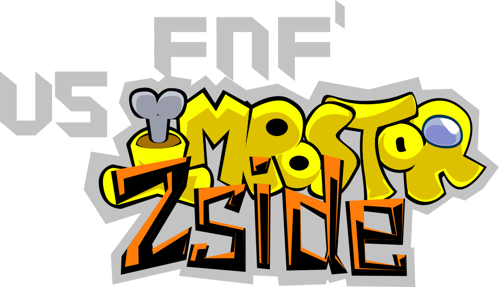

# Home

??? info "アナウンス 表示するにはクリックしてください"
    ??? note "アップデートが予定されているmod"
        現在、modはアップデートを制作中です。
        このwikiには仮の画像や記事があります。
        > v1.1.0及びv2.0を制作中

    ??? warning "記事のフレームワークの変更"
        この記事は現在、MkDocs(Materialテーマ)を使用して作成しています。
        
        しかし、MkDocs開発チームの崩壊騒動を受け、
        MkDocs-materialの開発者たちが作成した、「Zensical」への変更を検討しております。

        したがって、この記事はZensicalへの移行完了まで、作成を停止しております。

        こ理解よろしくお願いします。
    ??? warning "未完成のフレームワーク、Zensicalについて - 移行後の注意点"
        Zensicalは未完成であり、IPad等とWin11 Desktopとの表示が一致していない箇所があります。

        今後のZensicalのアップデートで改善されるとは思いますが、それまでは表示の一貫性がないことをご理解ください。

    

    

これがVS IMPOSTOR Zsideだ。

現在制作中のバージョン: `v1.1.0`

進捗: <progress value="13" max="100">13%</progress>

## クレジット
### 著者
* ようば

### Funkin' Zside Team
* ようば - ディレクター, 作曲者, アーティスト, アニメーター及びプログラマー。
* しくみろ - アーティスト。
* 山猫 照 - 作曲者。
